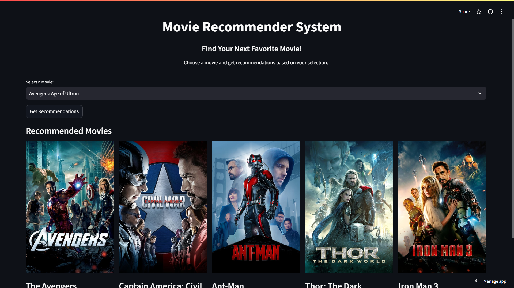

# 🎬 Movie Recommendation System



**[Live Demo: movie-recommendation-all.streamlit.app](https://movie-recommendation-all.streamlit.app/)**  
[](https://movie-recommendation-all.streamlit.app/)  

Your go-to tool for finding your next favorite movie!

## 🚀 Overview

The **Movie Recommendation System** is a content-based machine learning project that suggests movies similar to a selected movie. Built with Python and Streamlit, this project offers a sleek and interactive web app to explore movie recommendations.


## 🏗️ Project Structure

- **📊 Data Collection**: 
  - Datasets: `tmdb_5000_movies.csv` and `tmdb_5000_credits.csv` from Kaggle.
  - Data includes genres, keywords, cast, crew, and more!

- **🛠️ Data Preprocessing**:
  - Merged datasets and selected relevant columns.
  - Handled missing values, duplicates, and converted data into usable formats.
  - Created a `tags` column combining genres, cast, crew, and keywords.

- **🤖 Model Creation**:
  - Used `CountVectorizer` for vectorizing tags and calculated cosine similarity.
  - Pickle files save the model and data for quick access.

- **🌐 Website Development**:
  - Built with Streamlit to deliver an interactive experience.
  - Displays recommended movies with posters fetched from TMDB API.

- **🚀 Deployment**: 
  - The app is deployed and ready for you to explore!


## 🛠️ Installation

1. Clone the repository:
   ```bash
   git clone https://github.com/parth-jatav/movie-recommendation-system.git
   ```
2. Navigate to the project directory:
   ```bash
   cd movie-recommendation-system
   ```
3. Install the required dependencies:
   ```bash
   pip install -r requirements.txt
   ```
4. Run the Streamlit application:
   ```bash
   streamlit run app.py
   ```

## 🎥 Usage

1. Select a movie from the dropdown menu.
2. Click the "Get Recommendations" button.
3. View the recommended movies along with their posters.

## 📂 Dataset

- **Source**: Datasets are sourced from Kaggle:
  - [TMDB 5000 Movie Dataset](https://www.kaggle.com/tmdb/tmdb-movie-metadata)

## 🎯 Features

- **Content-Based Filtering**: Recommends movies based on metadata similarity.
- **Interactive UI**: Built with Streamlit for a smooth user experience.
- **Dynamic Posters**: Fetches movie posters from the TMDB API.

## 🛠️ Libraries Used

- **Pandas** 🐼
- **NumPy** 🔢
- **NLTK** 🧠
- **Scikit-learn** 📈
- **Streamlit** 🌐
- **Requests** 🌍
- **Pickle** 🥒

## 🤝 Contributing

Contributions are welcome! Please feel free to submit a pull request or open an issue if you have suggestions or bug reports.


## 🙌 Acknowledgments

- Thanks to [TMDB](https://www.themoviedb.org/) for the movie data.
- Kudos to Kaggle for hosting the datasets.


